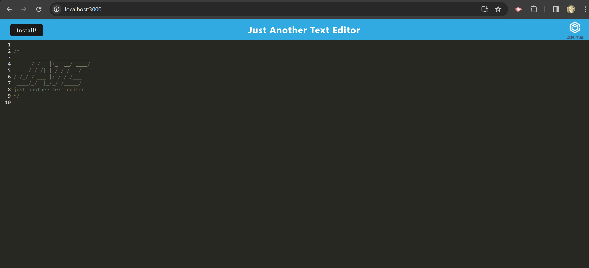

# Text-Editor-Application

## Description
A Text Editor application that runs in the browser using data persistence techniques for some options not supported by the browser. This application will also function offline.

## Table of Contents
* [Installation](#installation)
* [Usage](#usage)
* [License](#license)
* [Contributing](#contributing)
* [Tests](#tests)
* [Contact](#contact)

## Installation
 * webpack
 * idb

## Usage
Install all dependencies and run the scripts listed in the package.json file to deploy the application.
* Link:  

## Screenshot

## License

## Contributing
N/A

## Tests
N/A

## Contact
* GitHub: https://github.com/JennaJay

